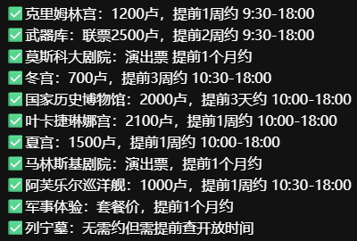

- [[健身]] #胸 +#核心
	- 热身
		- 绕肩
		- 弹力绳侧拉
		- 猫式伸展
		- 滚轴开背
	- 动作
		- 推胸器械，空杆，10个为一组三组【最后一组退阶】
		- 卷腹十个一组 三组
		- 平板支撑60秒两组
		- 高抬腿三组40 50 60
		- 开合跳两组
		-
		-
- [[旅游]][[俄罗斯]]
  id:: 68a5c24f-e2da-4306-8fdc-034e2688e091
	- 莫斯科
		- 10.1晚上8:20落地【谢列梅捷沃国际机场】
		- 住宿【；莫斯科：伊兹麦洛瓦伽玛酒店Hotel Izmailovo Gamma，这家酒店便宜但是室内稍微有点破旧，如果介意的话可以住这个酒店边上的beta酒店和alpha酒店】
		- 从机场到红场 
		- 行程
			- 预约 {:height 278, :width 400}
			- 红场
			- 圣瓦西里大教堂
			- 克里姆林宫【周四闭馆】
				- 参观点
					- 教堂群
					- 军械库【博物馆】
					- 钻石库
			- 古姆百货【在红场旁边】
			- 特列季亚科夫画廊【收藏了大量俄罗斯艺术珍品】
			- 普希金博物馆【俄罗斯最大的艺术博物馆之一】
	- 圣彼得堡10.3-10.5
		- 行程
			- 第一天10.3
				- 喀山大教堂【在涅瓦大街】【上午10点开门，门票免费，游览时间大概半小时】
				- 圣以撒大教堂【门票450卢，游览时间半个小时】
				- 滴血救世主大教堂【1个小时】【周三是不开门的，其余时间10点到17点半】
				- 冬宫博物馆【世界四大博物馆之一，逛完大约4—5个小时】【周五11点到20点】
				- 涅瓦大街【圣彼得堡要塞，进去是免费的，里面的教堂和监狱是要门票的，750卢布，监狱里面关押过高尔基，处死过列宁的哥哥乌里扬诺夫，监狱和教堂没有进去的必要，在外面拍】
			- 第二天10.4
				- 夏宫
				- 叶卡捷琳娜宫
			- 第三天10.5
				- 俄罗斯国家博物馆
		- 飞摩尔曼斯克2小时，火车24小时
		- 住宿可以在涅瓦大街【圣彼得堡：金三角精品酒店Boutique Hotel Golden Triangle】
	- 摩尔曼斯克10.6-10.7
		- 第一天10.6【追极光】
			- 北极光公园
		- 第二天10.7
		- 捷里一日游【龙蛋沙滩+新捷里+老捷里+出海追鲸】
	- 10.8 摩尔曼2.5个小时飞机到莫斯科
	- 莫斯科
		- 10.8晚上10点40起飞【谢列梅捷沃国际机场】